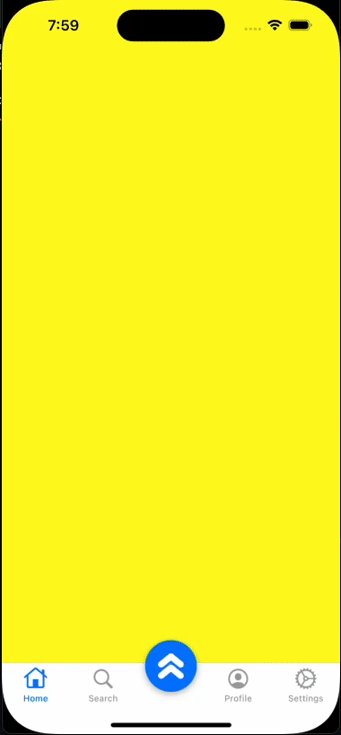

# Tab Bar Custom Button Demo

## Overview
This app demonstrates how to implement a UITabBar with a custom button placed in the center, alongside standard tab bar items. It showcases:

- Adding a custom floating button in the middle of the tab bar.
- Handling button actions separately from tab bar items.
- Maintaining a smooth UI/UX experience with a mix of system and custom elements.

## Features
✅ Standard UITabBar with multiple items.

✅ A center-aligned custom button that performs a separate action.

✅ Custom styling for the tab bar and button.

## App Demo
| App Demo                                |
| -------------------------------------- |
|  |

[Full App Demo](Demo/TabarDemo.mov)

## Requirements
- iOS 14.0 or later.
- Xcode 13.0 or later.
